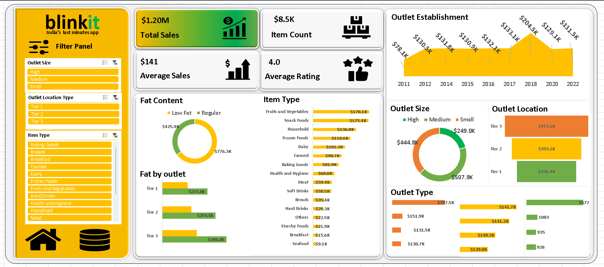

# Blinkit Sales Dashboard – Excel Project  

## 📌 Project Overview  
This project showcases an **interactive and visually appealing Excel dashboard** designed to analyze Blinkit’s sales performance across various dimensions such as outlet size, location, and item type.  

The dashboard provides **actionable insights** for decision-making by displaying KPIs, trends, and category-wise performance in a simple, interactive format.  

---

## 🎯 Features  
- **Dynamic KPIs** – Total Sales, Item Count, Average Sales, and Average Rating.  
- **Interactive Slicers** – Filter data by outlet size, location, and item type.  
- **Sales Breakdown** – Visual charts for category-wise and location-wise performance.  
- **Fat Content Analysis** – Representation of low, medium, and high-fat content items.  
- **Year-wise Trends** – Sales data from 2011 to 2022.  

---

## 🛠 Tools & Techniques Used  
- **Microsoft Excel** – Dashboard design and visualization  
- **Pivot Tables & Charts** – For data summarization  
- **Slicers** – For interactive filtering  
- **Conditional Formatting** – For better visual clarity  
- **Excel Functions** – SUM, AVERAGE, VLOOKUP, TEXT, YEAR, etc.  

---

## 📂 Project Structure  
```
📁 Blinkit-Sales-Dashboard
│── Blinkit_Sales_Dashboard.xlsx   # Excel dashboard file
│── Screenshot.png                 # Dashboard preview
│── README.md                      # Project documentation
```

---

## 📊 Dashboard Preview  
  

---

## 🚀 How to Use  
1. Download the `Blinkit_Sales_Dashboard.xlsx` file from the repository.  
2. Open in Microsoft Excel (2016 or later recommended).  
3. Use slicers to filter data interactively.  

---

## 📧 Contact  
**Sachin Kumar Shah**  
📍 Bengaluru, Karnataka  
📩 sachin.k.shah13@gmail.com  
🔗 [LinkedIn](https://www.linkedin.com/in/sachin-shah16/)  
